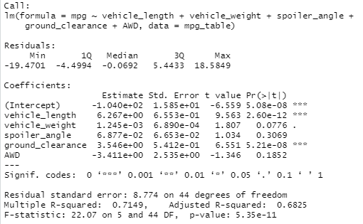
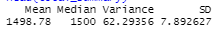
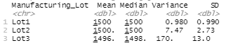
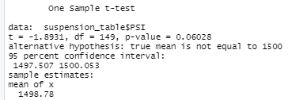
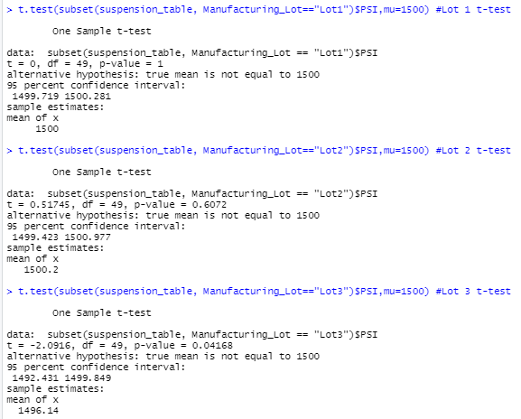

# MechaCar_Statistical_Analysis

Module 15

## Overview

In this analysis, a new car prototype is evaluated for issues during production using statistics and R.

## Linear Regression to Predict MPG

Linear regression was performed on provided data to determine factors that may affect mpg.

- The variables providing a non-random amount of variance to the mpg values in the dataset are length and ground clearance. The vehicle's   weight is not as significant, but still may have a correlation to mpg.  The variables used for this analysis may be expanded to include   other factors and even normalized to look more closely at the potential correlations.

- Using the multiple linear regression model and the significance level of 0.05, the slope of the linear model is not considered to be     zero because the p-value of the hypothesis test was 5.35e-11 (<0.05).

- It appears that this model will predict the mpg correctly ~71% of the time based on the R-squared value of 0.7149.

## Summary Statistics on Suspension Coils

An analysis of suspension coils was performed to compare manufacturing lots.

 

- The design specifications for the MechaCar suspension coils require a variance <= 100lbs per square inch.  All manufacturing lots in     total meet this standard metric at ~62, but may be skewed by Lot 3 which is outside the accepted variance window at 170 +/- 13.  Lots 1   and 2 were within specifications.

## T-Tests on Suspension Coils

T-tests were performed to determine if a statistically significant difference in the suspension coil lots was identified.

- For the overall data, assuming our significance level was 0.05, our p-value is above our significance level at 0.06. Therefore, we do     not have sufficient evidence to reject the null hypothesis, meaning that the two means are statistically similar.

- For the individual lot numbers, Lot 3 is 0.04 which is below the significance level showing that it is statistically different from the   other lots. The other two lots' means are statistically similar.

## Study Design: MechaCar vs Competition

In future studies, MechaCar will be compared to competitors.  Market research will be conducted to find similar cars that sell well to the MechaCar for the analysis.  Target features include cost, safety rating, and mpg highway. These analyses may offer insights to areas that need improvement and may asisst with sales projections.

- Hypothesis:  The selected feature values are similar to competitors.

- Null Hypothesis:  The selected feature values are not similar to competitors.

- Statistical tests to be used:

    - multiple linear regression for competitors to determine if any/which features may affect sales.

        - after determining which may affect sales, comparisons to MechaCar will be made.

    - price point vs features that affect sales variance will be calculated across competitors and MechaCar with ANOVA testing to               assess variance to determine if the competitors and MechaCar are similar.

- Needed data includes: competitors sales data and data from MechaCar and competitor on cost, safety rating and mpg reports.
